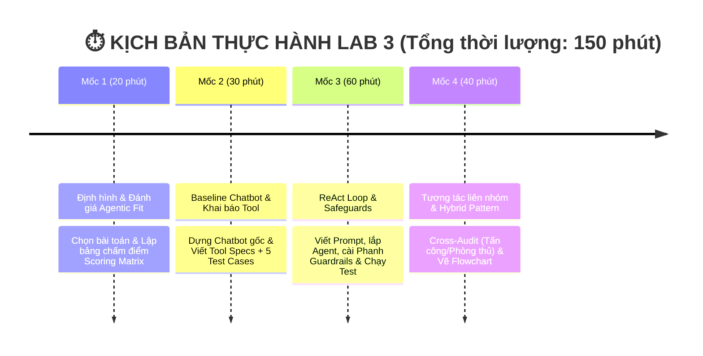

# 🏫 BÀI LAB 3: CHATBOT VS REACT AGENT - TỪ Ý TƯỞNG ĐẾN THỰC THI

## 🏠 RentMate — Trợ lý tìm và đặt lịch xem nhà

Phiên bản của nhóm triển khai đề tài số 10 với dữ liệu mẫu tại Hà Nội và
TP.HCM. Ứng dụng có đủ bốn cấp độ AI, ReAct loop thật, FastAPI, React
TypeScript, SQLite và trace `Thought -> Action -> Observation`.

### Chạy nhanh

```powershell
python -m venv .venv
.venv\Scripts\Activate.ps1
python -m pip install -r requirements.txt
Copy-Item .env.example .env
python src/app.py
```

Chạy web ở hai terminal:

```powershell
uvicorn src.web_api:app --reload
```

```powershell
cd frontend
npm install
npm run dev
```

Mở `http://localhost:5173`. Chế độ mặc định là `mock`, không cần API key.
Để dùng model thật, đổi `LLM_PROVIDER` và API key tương ứng trong `.env`.

### Kiểm thử và build

```powershell
python -m pytest -q
cd frontend
npm test -- --run
npm run build
```

Sau `npm run build`, FastAPI phục vụ bản React đã build tại
`http://localhost:8000`.

### Phân công nhóm

| Thành viên | Role | Phạm vi sở hữu |
| :--- | :--- | :--- |
| Nguyễn Đăng Long | Role 1 + Role 5, Frontend | Test cases, React UI, trace, flowchart và đánh giá |
| Lương Minh Quân | Role 2 | Rental tools, SQLite, fixture và data validation |
| Lê Đăng Tấn | Role 3 | Prompts, providers và demo bốn cấp độ AI |
| Đào Minh Chiến | Role 4 | AgentEngine, ReAct loop, FastAPI và tích hợp |

### Tool của Agent

- `search_properties`: tìm căn theo khu vực, ngân sách, diện tích và tiện ích.
- `get_property_details`: lấy thông tin xác thực của một căn.
- `compare_properties`: so sánh tối đa ba căn.
- `get_available_viewing_slots`: kiểm tra lịch xem còn trống.
- `book_viewing`: đặt lịch sau khi người dùng xác nhận trên giao diện.

Booking được lưu trong `data/rentmate.db`; database, file `.env` và dữ liệu
export không được commit. JSON export và trace luôn che số điện thoại.

---

### 💡 1. LỜI NÓI ĐẦU & NỀN TẢNG LÝ THUYẾT (4 CẤP ĐỘ AI HỘI THOẠI)

Bài Lab giúp bạn hiểu rõ sự tiến hóa qua 4 cấp độ của hệ thống AI:

| Cấp độ | Loại hệ thống | Đặc điểm chính | Sự xuất hiện trong Bài Lab |
| :---: | :--- | :--- | :--- |
| **Cấp 1** | **Rule-Based Bot** | Khớp từ khóa if/else cố định, không có LLM | *Minh họa lịch sử* |
| **Cấp 2** | **LLM Chatbot** | Dùng LLM sinh text mượt, nhưng không gọi được Tool | **Chatbot Baseline** (Phần thực hành 1) |
| **Cấp 3** | **Reactive Agent** | Suy luận `Thought -> Action -> Observation` & gọi Tool | **ReAct Agent Loop** (Trọng tâm Bài Lab) |
| **Cấp 4** | **Autonomous Agent** | Tự rã mục tiêu (Planning), tự đánh giá & có Memory | 🎁 **Phần Bonus Nâng cao (+10%)** |

* 🤖 **Chatbot thông thường (Cấp 2)**: Giống như một **chuyên gia lý thuyết** — chỉ trả lời dựa trên kiến thức tĩnh có sẵn trong LLM, không thể tra cứu số liệu thực tế hay tự thực hiện thao tác.
* 🧠 **ReAct Agent (Cấp 3)**: Giống như một **trợ lý thực hành** — vừa biết suy nghĩ (**Thought**), vừa biết chủ động dùng công cụ (**Action**) như phần mềm tra cứu/tính toán, và quan sát kết quả (**Observation**) để giải quyết các bài toán thực tế.

---

### 📂 2. CẤU TRÚC THƯ MỤC DỰ ÁN

```text
📁 Day03-D305/
├── 📁 config/
│   ├── 📄 rental_inventory.json  <-- 14 căn mẫu Hà Nội/TP.HCM
│   └── 📄 test_cases.json        <-- 5 test cases theo rubric
├── 📁 src/
│   ├── 📁 ai_levels/             <-- Demo bốn cấp độ AI
│   ├── 📄 app.py                 <-- AgentEngine, parser, executor, CLI
│   ├── 📄 prompts.py             <-- Baseline/ReAct/Autonomous prompts
│   ├── 📄 providers.py           <-- Mock + các LLM provider tùy chọn
│   ├── 📄 storage.py             <-- SQLite inventory, slots và booking
│   ├── 📄 tools.py               <-- 5 rental tools và registry
│   └── 📄 web_api.py             <-- FastAPI adapter
├── 📁 frontend/                  <-- Vite + React + TypeScript
├── 📁 tests/                     <-- Backend integration tests
└── 📁 docs/
    ├── 📄 trace_eval.md          <-- Trace, RCA và kết quả định lượng
    └── 📄 hybrid_flowchart.mermaid
```

---

### ⏱️ 3. LỘ TRÌNH THỰC HÀNH (4 MỐC / 150 PHÚT)



---

### 💯 4. CƠ CHẾ CHẤM ĐIỂM  (SCORING RUBRIC)

| Tiêu chí                                |  Trọng số  | Mô tả chi tiết                                                                                                             | Bằng chứng kiểm tra (Artifacts)                                        |
| :---------------------------------------- | :-----------: | :---------------------------------------------------------------------------------------------------------------------------- | :------------------------------------------------------------------------ |
| **1. Agentic Fit & Test Design**    | **20%** | Phân tích đúng 4 tiêu chí Agentic Fit cho chủ đề tự chọn. Bộ test cases đủ góc cạnh (đơn giản, multi-step, edge cases). | Bảng chấm điểm (`docs/trace_eval.md`) + `config/test_cases.json`. |
| **2. ReAct Implementation & Tools** | **30%** | Tool description rõ ràng. Vòng lặp ReAct chạy đúng chuẩn `Thought -> Action -> Observation`.                         | Code trong `src/tools.py` + `src/app.py`.                              |
| **3. Guardrails & Observability**   | **20%** | Bắt được lỗi loop, có max iterations (Guardrail). Trích xuất được ít nhất 1 Trace log hoàn chỉnh.                     | File `src/prompts.py` + Log trong `docs/trace_eval.md`.                |
| **4. Inter-group Attack & Defense** | **20%** | Phản biện tốt khi gọi ngẫu nhiên hoặc cử 1 bạn đi chấm chéo (+10đ). Agent chống đỡ tốt / fallback chuẩn (+10đ).        | Biên bản Cross-Audit / Trả lời phản biện.                             |
| **5. Hybrid Decision Flowchart**    | **10%** | Sơ đồ thể hiện rõ khi nào đi Chatbot path, khi nào đi ReAct Agent path.                                             | Sơ đồ Flowchart (`docs/hybrid_flowchart.mermaid`).                   |
| 🎁 **BONUS: Autonomous Agent**     | **+10%**| Thử nghiệm tính năng Planning (tự chia nhỏ mục tiêu) hoặc Memory cho Agent (Cấp 4).                                  | Demo code trong `src/app.py` hoặc giải trình trong report.           |

---

> 🚀 **BẮT ĐẦU LÀM BÀI**:
> Vui lòng mở sổ tay thực hành 👉 **[PHAN_CONG_CONG_VIEC.md](docs/PHAN_CONG_CONG_VIEC.md)** để xem phân vai và checklist công việc cụ thể cho từng thành viên!
